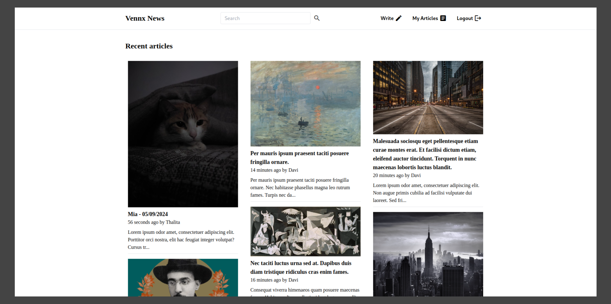

# Vennx - Teste Técnico
*Aplicação desenvolvida para a etapa de conhecimentos técnicos da Vennx.*

## Introdução
Trata-se de uma aplicação de notícias/artigos simples desenvolvida com a seguinte stack:
- PHP 8.3
- Laravel 11
- Livewire
- Tailwind CSS
- MySQL 9
- Docker
- PHPUnit 11

A aplicação apresenta um relacionamento de duas entidades: Article e User.
Um artigo necessita de um autor (User) para ser publicado e um autor pode publicar 1 ou mais artigos.

## Metodologia de desenvolvimento
Optei por evitar muitas abstrações e utilizar as convenções do framework onde foi possível, como por exemplo:
- Nomeação de Models/Relacionamentos/Migrations
- Resource Controllers
- Route Model Binding
- Form Requests
- Factories
- Seeders
- Policies

OBS: Seria possível utilizar uma arquitetura mais robusta/flexível e padrões mais rebuscados,
porém para o cenário de um CRUD acredito que seria contraproducente.

## Features:
- Autenticação com OAuth2 (Google)
- Testes automatizados de integração
- Aplicação conteinerizada
- Publicada em ambiente de homologação com SSL (https://vennx.davisenra.com.br)
- Design responsivo
- CRUD completo de Article
- CI com Github Actions

## Ambiente de desenvolvimento via Docker

Requisitos:
- Git
- Docker
- Chaves de OAuth2 na Google (https://console.cloud.google.com/apis/credentials)

Instruções:
1. `git clone https://github.com/davisenra/vennx-news`
2. `cd vennx-news`
3. `cp .env.example .env`
4. Setar as variáveis: `GOOGLE_CLIENT_ID`, `GOOGLE_CLIENT_SECRET` e `GOOGLE_REDIRECT_URL`
5. `docker compose build --no-cache`
6. `docker compose up -d`
7. `docker compose exec app composer install`
8. `docker compose exec app npm install`
9. `docker compose exec app php artisan key:generate`
10. `docker compose exec app php artisan storage:link`
11. `docker compose exec app php artisan migrate:fresh`
12. `docker compose exec app php artisan db:seed`
13. `docker compose exec app npm run dev`

- Se tudo ocorreu corretamente a aplicação deve estar disponível em `http://localhost:8080`.
- O seeder irá gerar um usuário de testes com email `test@example.com` e senha `password`, o mesmo pode ser usado para obter um token JWT e testar manualmente os endpoints.

## Suíte de testes
1. `docker compose exec app php artisan test`
